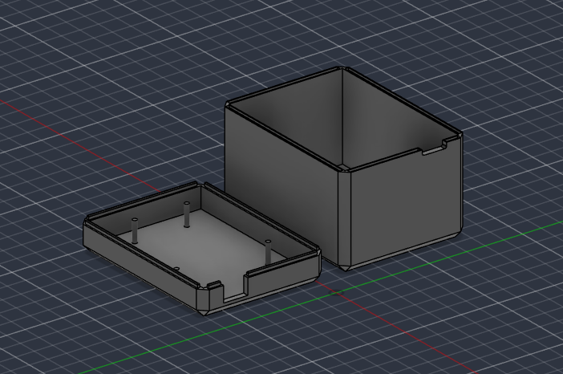

# Consola 1602


> Firmware para Arduino Uno que convierte un **LCD de 16x2 caracteres** en una pequeña consola de escritorio: reloj, Snake, test de reflejos y Pomodoro.

**[▶ Probar en el navegador](https://wokwi.com/projects/TU_ID)** — simulación completa con LCD, botones y zumbador. No hace falta comprar nada para jugar al Snake.

**Consola 1602** es un firmware en C++ que saca todo el partido posible a la pantalla más barata que existe. Sobre un LCD de dos líneas, cinco botones y un zumbador, funcionan cuatro aplicaciones con menú, sonido y ajustes que sobreviven al apagón. La arquitectura es una **máquina de estados** en la que cada aplicación es un módulo independiente, sin una sola llamada bloqueante en el bucle principal.

<p align="center">
  
</p>

---

## Características

- **Reloj** con dígitos grandes de dos filas de altura, construidos con caracteres definidos a medida en la CGRAM del display.
- **Snake** sobre un tablero real de 16x4: cada celda del LCD se divide en mitad superior e inferior para doblar la resolución vertical.
- **Test de reflejos** de cinco rondas con espera aleatoria, penalización por adelantarse y cálculo del tiempo medio.
- **Pomodoro** con cuenta atrás en dígitos grandes, ciclos configurables y notas contextuales en cada cambio de fase.
- **Notas** rotativas navegables, almacenadas en memoria de programa para no gastar RAM.
- **Ajustes persistentes** en EEPROM: hora, sonido, brillo, apagado de la luz, calibración del reloj y récords de las tres aplicaciones.
- **Vocabulario sonoro**: cada evento tiene su propio patrón de pitidos, de modo que se reconoce lo que ha pasado sin mirar la pantalla.
- **Reloj por software** calibrable en milisegundos por hora, sin necesidad de un módulo RTC.
- **Retroiluminación** regulable por PWM con apagado automático por inactividad.
- **Firmware sin bloqueos**: ni un `delay()` en el bucle principal.
- **Diagnóstico del sistema**: voltaje real de alimentación, temperatura del chip, RAM libre y tiempo encendido, todo leído de periféricos internos del ATmega328P sin un solo componente extra.
- **Carcasa imprimible en 3D**, con el modelo editable de Fusion 360 y el STL listo para laminar.

---

## Controles

Cinco botones para todo. La convención es la misma en cada aplicación:

| Botón            | Acción                                     |
|------------------|--------------------------------------------|
| `OK` (pulsación) | Seleccionar, confirmar, arrancar o pausar  |
| `OK` (mantener)  | Volver atrás                               |
| `▲` `▼`          | Navegar y ajustar valores                  |
| `◄` `►`          | Cambiar campo o modificar el valor         |

### Por aplicación

| Aplicación | Controles                                                              |
|------------|------------------------------------------------------------------------|
| Reloj      | `OK` abre el menú                                                      |
| Snake      | Dirección con las cuatro flechas · `OK` pausa · `OK` reinicia al morir |
| Reflejos   | `OK` empieza · pulsa la flecha que indique la pantalla                 |
| Pomodoro   | `OK` arranca y pausa · `►` salta de fase · `◄` reinicia la fase        |
| Notas      | `◄` `►` cambian de nota · `OK` alterna el modo automático              |
| Sistema    | `▲` `▼` calibran el sensor de temperatura                              |
| Ajustes    | `▲` `▼` eligen · `◄` `►` modifican · `OK` mantenido guarda y sale      |

---

## Materiales

| Componente                       | Cantidad | Precio aproximado |
|----------------------------------|----------|-------------------|
| Arduino Uno R3                   | 1        | 10 €              |
| LCD 16x2 con HD44780 (paralelo)  | 1        | 3 €               |
| Potenciómetro de 10 kΩ           | 1        | 0,30 €            |
| Pulsadores táctiles              | 5        | 0,50 €            |
| Zumbador activo de 5 V           | 1        | 0,50 €            |
| Resistencia de 220 Ω             | 1        | 0,05 €            |

---

## Conexiones

### LCD

| Pin del LCD  | Destino                                     |
|--------------|---------------------------------------------|
| 1 `VSS`      | GND                                         |
| 2 `VDD`      | 5 V                                         |
| 3 `V0`       | Cursor del potenciómetro de 10 kΩ           |
| 4 `RS`       | D12                                         |
| 5 `RW`       | GND                                         |
| 6 `E`        | D11                                         |
| 11–14 `D4–D7`| D5, D4, D3, D2                              |
| 15 `A`       | Resistencia de 220 Ω → D9                   |
| 16 `K`       | GND                                         |

Los extremos del potenciómetro van a 5 V y GND. Ese potenciómetro controla el **contraste**: si el LCD se enciende pero no muestra nada, o solo aparecen cuadrados negros, es lo primero que hay que ajustar.

### Botones y zumbador

| Componente | Pin  |
|------------|------|
| `▲`        | D6   |
| `▼`        | D7   |
| `◄`        | D10  |
| `►`        | A0   |
| `OK`       | A1   |
| Zumbador   | D8   |

Los botones van directos a GND, sin resistencias: el firmware usa los pull-up internos del microcontrolador.

Los pines **A4** y **A5** se dejan libres a propósito. Son el bus I²C, de forma que se puede añadir un módulo RTC DS3231 más adelante sin tocar el resto del cableado.

---

## Carcasa

<p align="center">
  
</p>

| Archivo                       | Formato      | Para qué sirve                          |
|-------------------------------|--------------|-----------------------------------------|
| [`hardware/carcasa.f3d`](hardware/carcasa.f3d) | Fusion 360   | Fuente editable, con el historial de diseño |
| [`hardware/carcasa.stl`](hardware/carcasa.stl) | Malla STL    | Listo para laminar e imprimir           |

GitHub renderiza los STL directamente en el navegador, así que puedes girar la pieza sin descargar nada: solo hay que pinchar en el archivo.

### Ajustes de impresión

| Parámetro          | Valor        |
|--------------------|--------------|
| Material           | PLA          |
| Altura de capa     | 0,2 mm       |
| Relleno            | 20 %         |
| Soportes           | No           |
| Perímetros         | 3            |

---

## Cargar el firmware

Solo hace falta la librería `LiquidCrystal`, que viene incluida en el IDE de Arduino.

```bash
# Clona el repositorio
git clone https://github.com/zoraizmahmood/Consola-1602.git
cd Consola-1602

# Compila y sube con arduino-cli
arduino-cli compile --fqbn arduino:avr:uno .
arduino-cli upload  --fqbn arduino:avr:uno -p /dev/ttyACM0 .
```

También puedes abrir `Consola-1602.ino` directamente en el IDE de Arduino y subirlo con `Ctrl+U`.

> El nombre de la carpeta coincide con el del sketch, así que el repositorio recién clonado se abre sin que el IDE pida moverlo de sitio.

---

## Simular en el navegador

El repositorio incluye un `diagram.json` de [Wokwi](https://wokwi.com), que simula el ATmega328P instrucción a instrucción. Sirve para dos cosas: probar el firmware sin tener el hardware delante, y como **descripción formal del cableado** — más fiable que las tablas de arriba, porque es lo que se ejecuta.

Para abrirlo: crea un proyecto nuevo de Arduino Uno en Wokwi, pega el contenido de `Consola-1602.ino` en la pestaña del sketch y el de `diagram.json` en la del diagrama.

Con la extensión de Wokwi para VS Code, el `wokwi.toml` ya está preparado:

```bash
arduino-cli compile --fqbn arduino:avr:uno --output-dir build .
```

---

## Presupuesto de memoria

| Recurso                  | Uso      | Máximo del Uno | Ocupación |
|--------------------------|----------|----------------|-----------|
| Memoria de programa      | 15 844 B | 32 256 B       | 48 %      |
| RAM (variables globales) | 696 B    | 2 048 B        | 34 %      |

La CI mide ambas cifras en cada push y **falla si el firmware supera los 24 KB de programa o los 1,2 KB de RAM**, dejando margen para la pila. Las cifras de cada compilación quedan publicadas en el resumen de la ejecución.

El margen sale de dos decisiones: todas las cadenas literales viven en memoria de programa mediante `F()` y `PROGMEM`, y las estructuras grandes —el tablero de Snake y su cuerpo— se dimensionan de forma estática, sin reservas dinámicas.

---

## Estructura del proyecto

```
Consola-1602/
├── Consola-1602.ino    # Firmware completo
├── diagram.json        # Cableado para el simulador de Wokwi
├── wokwi.toml          # Configuración de la extensión de VS Code
├── hardware/
│   ├── carcasa.f3d     # Modelo editable de Fusion 360
│   └── carcasa.stl     # Malla lista para imprimir
├── assets/             # GIF de la demo, render y fotos del montaje
└── .github/workflows/
    └── build.yml       # Compilación automática para arduino:avr:uno
```

El firmware es un único archivo, organizado por secciones:

```
Núcleo        Botones (antirrebote, pulsación larga, autorepetición)
              Zumbador con patrones no bloqueantes
              Retroiluminación con apagado por inactividad
              Ajustes en EEPROM con versionado
              Reloj por software calibrable
              Fuente de dígitos grandes
Aplicaciones  Reloj · Menú · Snake · Reflejos · Pomodoro · Notas · Ajustes
```

---

## Arquitectura

Cada aplicación implementa dos funciones: `enter()`, que dibuja la pantalla e inicializa el estado, y `loop()`, que se llama en cada iteración y nunca bloquea. Una tabla de punteros las despacha:

```cpp
const App APPS[APP_COUNT] = {
  { home_enter,   home_loop   },
  { snake_enter,  snake_loop  },
  { reflex_enter, reflex_loop },
  // ...
};
```

Añadir una aplicación son tres líneas: las dos funciones, una entrada en `APPS[]` y otra en el menú.

Dos decisiones que merecen una nota:

- **La CGRAM se reprograma en caliente.** El LCD solo admite ocho caracteres a medida, y la fuente de dígitos grandes los ocupa todos. Snake carga sus propios siete glifos al entrar, y el reloj y el Pomodoro restauran la fuente grande al volver. Ese es el truco que permite tener las dos cosas.
- **Un cambio de aplicación descarta las pulsaciones pendientes** hasta que se sueltan todos los botones. Sin eso, mantener `OK` medio segundo selecciona una aplicación y sale de ella en el mismo gesto.

---

## Contexto

Primer proyecto de electrónica del perfil, en el punto donde el software se encuentra con el hardware: recursos contados (2 KB de RAM, 32 KB de memoria de programa), una pantalla de 32 caracteres y ninguna posibilidad de esconderse detrás de un framework.

## Créditos

La fuente de dígitos grandes 3x2 está basada en el clásico *BigNumbers* de la comunidad de Arduino.

## Autor

Creado por [zoraizmahmood](https://github.com/zoraizmahmood).

## Licencia

El firmware, bajo licencia [MIT](LICENSE). La carcasa de `hardware/`, bajo [CC BY 4.0](https://creativecommons.org/licenses/by/4.0/deed.es).
